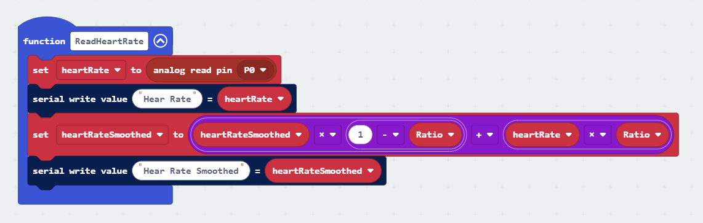

## Journal Entries

### Entry 1
Today we brainstormed potential projects to work on, we did this by initially grouping up and concepting ideas based off of generated factors such as wheter the devise used mechanical inouts or biometrics, or if it is a product for a human or not. W came up with a couple ideas detailed in the choosing a project section. After that I used the generator to help me with a baseline for my project. I decided to make a custom device for non-humans, that uses biometric inputs in an informative way. After some thought on this I had defined my product to be a pet health tracker, that would take biometric data of the users pet and give that information on a webpage.   

### Entry 2
Today we spoke about my project idea and spoke about some of its possible benefits and disadvantages that may arise. Some disadvantages were that it may be difficult to find a sensor that could track the animal's heartbeat or temperature from the neck area. A point made by one of my classmates was that the ear can be quite a good option for this that is readily used in the medical industry and used to measure oxygen levels. Instead of detecting the animal's temperature it could instead detect the environment temperature the animal is within using the microbits thermostat.  
The benefits of this could be to know how active the pet my be with the addition of a pedometer or gyro sensor. Having an lcd on the microbit it can also show a status of the pet on its collar as well as on the website in the form of a dynamic face.  

### Entry 3
I purchased a pulse sensor from Ebay that will arrive within the week for use in my project. I also began testing features using the microbit controller. I used the built in temperature sensor to set the temperature variable and then checked if the temperature was within 3 different ranges, setting the pets overall temperature condition depending on which range it was within such as cold, fine, or hot. I also setup a calibratable step counter that checks for changes in the microbits accelerometer that will count steps and calculate walk distance based on the set average step distance. 

### Entry 4
This week we spoke about how my device can benefit the user, have its own unique aspects, and have a strong foundation. We also speculated how our projects could evolve or adapt, and conceptualised other potential options.

How can my project have a strong conceptual foundation?  
My device will be shaped around meeting the needs of pet home owners who want more information about their pet, in a fun new way. The pet health industry already has alot of research, and it will be tested on animals.  

How will my project benefit the user, why would they want to use it?  
It will benefit the user by giving them a simple effective means to check their pets overall health and activity.  

What is it similar to?  
This device shares similarities to other pet health trackers shown below, especially the PetPace dog collar. Similarly it will share similarities to a fitbit.  

How is it unique  
My device is unique because it gives the user fun images of cats alongside the information about their pet health. It will have a warning system to alert the user of health changes and a display on the device that is quicker than checking the website information.

 

## Choosing A Project
In this section, using the provided generator I used the generated options both individually and, in a group, to come up with possible project ideas relating to responsive design.

 

### Quick Ideas - Group
1.  
Form - Custom hardware, physical hardware each person places finger on a device sensor  
Configuration - Multi person, game with multiple people causing stress  
Input - Biometrics - measuring heartrate of each person and anyone outside the measured output sends data  
Output - Haptic - Highest measurement gets zapped by device  

2.  
Form - Mobile app  
Configuration - Multiperson use app on their phone.  
Input - Environment Sensors collects each persons data (Geolocation) gives their weather  
Output - Informational Tells people if they will also get rain

 

### My Ideas - Individual
Form - Custom Hardware  
Configuration - Nonhuman  
Input - Biometrics  
Output - Informational  
This could be an informative biometrics reader for cats and dogs, to inform the owner of the animal's health such as vitals, temperature, and fatigue. It could be made from a microbit with a heart rate monitor and reading the animals temperature, a Wi-Fi chip or bluetooth could be used to send the information to a web application. This device could be made in a small form factor to be used as a collar attachment, provided these biometrics can be read from the neck area and cause minimal discomfort.

 

### Idea Feedback
We spoke about my project idea and spoke about some of its possible benefits and disadvantages that may arise. Some disadvantages were that it may be difficult to find a sensor that could track the animal's heartbeat or temperature from the neck area. A point made by one of my classmates was that the ear can be quite a good option for this that is readily used in the medical industry and used to measure oxygen levels. Instead of detecting the animal's temperature it could instead detect the environment temperature the animal is within using the microbits thermostat.  
The benefits of this could be to know how active the pet my be with the addition of a pedometer or gyro sensor. Having an lcd on the microbit it can also show a status of the pet on its collar as well as on the website in the form of a dynamic face smile or frown. 

 

## Similar Projects
### MeasureON!
MeasureON! is a dog heartrate monitor app that pairs with a device and provides consistent heart rate monitoring. It uses a harness that places the monitor on the lateral sides of the chest using sensory combs that manoeuvre through the dog's fur, alleviating the need to shave. This device is mainly used by veterinarians and requires hypoallergenic gel to be applied for conductivity.  
Device also measures temperature, respiratory rate, relative activity level, and ambient conditions.  
For this product, I like how they have used a harness to ensure the device stayed affixed in the optimal location. This may benefit my product. The downside is that this device is specifically for dogs, and if my product uses a harness it would need multiple harness sizes to accommodate large and small animals of different types. The sensor used is an effective option for heartrate monitoring, though I do not want the home user to need to apply a gel for results.  

 

### PetPace AI Smart Collar
PetPace is an AI smart collar that continually monitors a pet's health and GPS location, sending data to a phone app for pet owners to view. The device examines all essential vitals and biometrics to collect data that then through machine learning observes your pet's health over time, collecting essential data for your vet. The app sends alerts of early warning signs for need of veterinary care and also correlates your pet's data against thousands of similar pets. Thanks to the device collecting data every 2 minutes you can keep a constant update of your pet's condition through the app to check your pet's temperature, heart and respiration rate, the condition of its activity and sleep, as well as its GPS location.  
This product is a very good example of what I want my device to achieve, it gives indepth results that my device would benefit from. I am not a huge fan of the collar approach, however the collar provides a one size fits all format, and the sensor used seems effective. I will need to find a way to make my device unique from this one with features such as an in-built display, warning system, and a different approach to presenting results.  

 

### UID Temperature Monitoring System
The UID temperature monitoring system is an implanted RFID microchip that will measure an animal's temperature with high accuracy. Microchip readers are used to scan the chips measurements that are then sent to a computer using wireless or serial link communication. Microchips contain on-board memory for customised identifiers of each subject such as unique identifiers, gender, DOB, study number etc. System generally used for animals in a clinical or research setting and is beneficial for streamline temperature collection that is safer and more accurate than traditional methods.  
This device is a different approach to monitoring animal biometrics, however an owner may not want an implant in their pet, and the requirement for an infrared scanner is not an appropriate solution for checking the device. I like the stored information used to identify which animal is being scanned, as well as other information associated with that specific anim. This could benefit my product with bio information of the pet that is using the device.  

 

### Infrared Thermometer
The infrared monitor is a less invasive method for home users to check their pets temperature. Using a long probe the device measures heat waves around the ear drums and only requires one second to measure. The device allows for the sound to be turned off to avoid scaring the animal and has the option to view the temperature in degrees Celsius and Fahrenheit.  
An infrared thermometer may be an option to get temperature results of the pet, however a small device that must stay attathed to the pets ear would not be comfortable for the pet, making it not feasable just to get the added benefit of the pets temperature readout.  

 

# Animal Health Tracker
## Overview
Wearable Technology senses biometric data of pets.
A device for the user to keep track of their pet's health and wellbeing. Using different biometric sensors, it may collect input data such as heart rate, temperature, and number of steps or speed of movement and walk distance, and return output data of the overall health and happiness of the pet along with all information used to determine the results. It features a display to quickly check the results, and alerts the user with an alarm or sound when the pets health changes or is in poor condition.  
The data will be readable from a web page that will show details about each aspect of the pet and rate its overall happiness. It will also show little quirky images of each aspect that sums up the pets active levels, temperature, and happyness. May get images from API's or in-built images.

 

### Technology Required
Microbit V2 - microcontroller used to collect data and power devices.  
Pulse Sensor - reads the animals heartbeat.  
Accelerometer - reads number of steps taken or speed of movement.  
Thermometer - reads the external temperature surrounding the pet.  

### Concept Designs
I have worked on some concept designs of my product to work out what devices might be used and how they would be setup to be attached to my pet. Below is a design depicting the devices that would be used as well as two different variations, a collar, and a harness set-up.  

  

This image is a concept design of the webpage layout, showing the different forms of information that may be provided, and a concept of the different cat images that may be shown.  

 

 

## Development Process
### Microbit Tests
To get started on the device, I began by testing the microbits built in sensors that could benefit the project.  
I started with the temperature sensor, trying to detect the external temperature of the environment that the pet would be in. To do this I created a temperature variable that I then set to the current temperature the microbit sensor was receiving. Then I checked if the temperature was below a 15 degrees that is a temporary number I've defined as cold, and if not I checked if it was in a range between 15 and 30 that I defined as fine, and if not I checked if it was over 30 degrees that I defined as hot. Depending on therange that the temperature was in I set a variable for temperature state as either 0, 1, or 3, that I will use lter to calculate the pets overall condition. Finally using temp state I can then check at any time whether I want to show a happy or unhappy face on the microbit and play a melody when the tepmperature has entered a new range by only calling it if the temp state is not set to the current range. for the option of showing Fahrenheit on the eventual web page I also calculated it from the set temperature by applying the equasion F = C x (9/5) + 32. For convenience and reusability I separated these into separate functions.  

 

 

To create a step counter for the pets I first tested the on shake function to increment steps when the microbit was shaken. However I quickly discovered that the built in shake function was not sensetive enough to register steps from a smaller animal, and could not be adjusted. Following online information I found that an alternative to this is to check for changes in the microbits accelerometer strength value. I first implemented this method by checking if the acceleration strengh was greater than a defined value, and then increasing the steps variable by 1. To take this further I also created a walk distance variable to calculate the distance walked by the pet, based off of the average step distance and then multipolying it by the number of steps taken. THis will only be an estimation but is still a useful feature to have on the product.  
Unfortuunately this method to gather the number of steps taken proved to be ineffective as this function was simply called in the forever method, resulting in many steps being registered as long as the accelleration value was exceeding the devined strength value.  
I also utilised button A and B on the device as a function to check the number of steps taken, as well as resetting the step counter and walk distance. The benefit of the pet state function allowed me to return to the oet state image after 2 seconds.  

 

To fix the step counter I performed some various tests and eventually found the best option was to refine the strength value and also create a variable to check if a step had been recently registered to limit the number of multiple steps being registered in a single step, that wouold be set to true once a step was taken. after .2 seconds the varible would be reverted to false to allow the next step to be registered. This efectively allows the apex of the accelerometer strength value to be limited to a timeframe and strength that may be adjusted through testing to find the perfect values. This is a rudimentary method to achieve this with certain inacuracies that may arrise but seems to be the best option for the use case.  
I also added a clear screen function when button A or B was pressed for a cleaner outcome when showing step values on the LED display.  

 

As the set temp function did not need to be checked every tick of the microbit, I moved it to its own timed loop that could check the temperature every 5 seconds for the time being. This will most likely be changed to every minute or 5 minutes as the temperature will generally not change that often resulting in unnecessary calls.  
Also as the microbit is a V2 it has a logo button that may be pressed, so I utilised its functionality to show the current temperature in degrees celcius when pressed, before returning to the current pet state.  

 

### Adding A Pulse Sensor
On make code I setup a simple function to read the inputs from the pulse sensor. I began by creating 2 variables called heartRate and heartRateSmoothed. I will be using the microbit pin 0 to read the values recieved from the pulse sensor so I set the heartRate variable to the pin 0 using analog read pin, which then was made visible using serial write value. To get a smoothed result I then used a calculation for smoothing the values of the heartRate variable that is shown below. This requireed a variable I called ratio that could be changed to increase or decrease the smoothing that I currently set to '.05'. heartRateSmoothed was also made visible using serial read value.  

  

After connecting the pule sensor device to the micro bit using its 3 volt, earth, and 0 pins, I was able to recieve data and check the sensors effectiveness. Below you can see the sensor reading my heart rate with the raw data on the bottom and the smoothed data on top.  

  

Now that I have confirmed the code and sensor is working I began tests with the sensor on my cat. Right away I was having trouble reading the pets heartrate as pointed out by my tutor because the pulse sensor requires skin contact for effective results. Luckily my cat has very short hair and areas with visible skin so after testing different areas such as the neck, chest, and skin, I found an area on the neck that gave results. Unfortunately these results still are not great, and in most scenarios using this sensor on other pets with more fur the user would have trouble getting effective results. This creates a problem for my devices main use case and I will have to think about weather I should try other sensor types or even reevaluate what my device could be used for, or even change it entirely.  

  

I have decide in the meantime to continue with the device as intended, and if I can't use the hearnt rate monitor effectively for my pet then I would leave it as conceptual as more complex devices would be required. Moving on, I decided to make code to read the beats per minute from the smoothed result. The approach I have taken for this is not perfect and may require more vigarous smoothing to be more accurate. What I have done is taken the smoothed heart rate and each time it updates the value, it would check if it is lower than the last value, determining that it has reached the peak of the heart beat and is now reducing. Then it would add to the number of heart beats and set a variable to ensure other beats aren't added until the heartrate starts to increase from its previous result. It would continue to do this and count beats, and it would check the number of beats every 5 seconds and calculate the average BPM from that value. I can later increase the windown between bpm calculations for more accurate readings.

  

### Webpage Development
Taking a break from microbit coding, I moved onto doing some concept designes that are detailed in the concept designs section, this would help me better understand the layout of the webpage and what infromation it would display.  
To get started I began categorising each section of the webpage indo different containers so that they may be layed out in the desired format. For now I have filled in the page with placeholder information that would later be changed for the dynamic inputs from the microbit. The categorise containers and headers share classes so I can style them all the same for quicker implementation. This is the same for the placeholder image that I have used. Below you can see my current setup, the pet overview has prefilled information as a bio of my pet, I would like it to give the option for the user to fill this information that would then be stored on the device, however I think that I beyond the scope of tis task so for now the device will have this information hard coded to my pet specifically.  

  

I then implemented some basic styling to the webpage cascading style sheet. For this I consulted Chat GPT to help me implement flexboxes and dynamic scaling to make the webpage have a more responsive design. For this I used flexboxes to layout the container to show the information to the left and the image to the right, and added a flex to the text to ensure it is formated in a column. To scale the content as the browser width is decreased I used a clamp that uses vw units for dynamic sizing that also suits multiple resolutions.  
When the display has been scaled below 940 pixels, the container is then oiented as a column instead of row and then center aligns the content. Here I defined the text to stay a fixed size and allowed the image to contine sacling down until the webpage is minimum width.  

  

  

Here is the oucome of the current webpage implementation, showing the 2 different layouts and the predefined information.

  

  

To receive the information from the microbit I need to be able to connect it to the webpage. For this I used components from a webpage that Toby provided us in DES221 that connects and either sends or receives serial data with a connected microbit. This was really helpful giving me a basis to work from, though I needed to alter the serial component to receive the correct type of serial information I required. I used Chat GPT once more to help me with the following implementations. Thou I don't fully understand it, the serial component now receives the serial strings and dispathces a custom event to then use that information in my code. I ensured it was a modular event so I could define what serial values it would look for to define each section of my webpage.  

  

Then inside my java script it now listens for a serial value and then using that value which is split into the received label and value, it checks for that label and then updates the associated id with that information. There is also 2 functions, 1 for adding the received celcius and fahrenheit serial data and adding it together to show as a single string on the webpage, and 1 for the temperature state so that the webpage will show 1 of 3 different string depending on the received state value.  

  

  

I am now testing tha the microbit is connecting with the webpage and displaying the received serial data on the webpage. Below you can see the id's in my html that are updated from the java script function. And below that you can see that it is infact receiving and displaying the information on the webpage. This was a big win as it was probably the most complex part of the project, which I could not have completed without Toby's code and the assistance of Chat GPT. Now I will just need to calculate more information on the microbit to send through such as BPM, active, and overall states so that I can display defined calculated status' from the information. and use those status' to determine the type of cat images to show. I would also like to display the heart rate omn a graph.

  

  

 

## References
MeasureON! Dog Heart Rate Monitor - https://vetmeasure.com/continuous-heart-rate-monitor/  
PetPace - https://petpace.com/  
UID Temperature Monitoring System - https://www.uidevices.com/laboratory-animal-temperature/  
Infrared Thermometer - https://www.gosupps.com/dog-ear-temperature-monitor-pet-infrared-thermometer-only-for-pets-measure-in-1-second-mute-function-c-f-switchable-blue.html?srsltid=AfmBOorF7DzYrcJCc1eii48Vd4hFJCoi1JKDK0yf57EgcQsOX40jelz-mm4  
